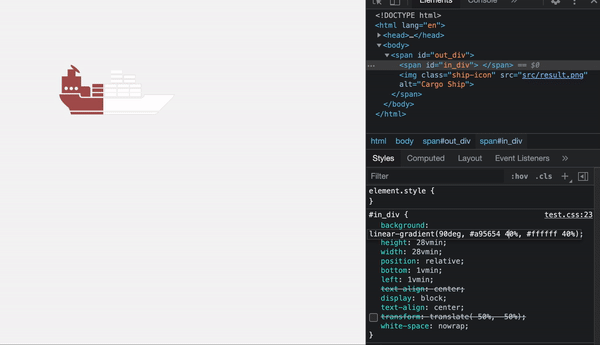

# Reversing Transeparency
이미지의 투명한 부분을 원하는 색으로 반전시켜주는 프로그램

---

## Example

| Before Conversion | After Conversion |
| ----------------- | ---------------- |
|  |  |

## Caution

1. This program uses `opencv-python` and `numpy` packages.
2. You should use the image file with a transparent background, such as '.png'. 

---

Made by Lee Dong-geon, 2021. 08. 14.

## Application



### HTML Code
```html
<!DOCTYPE html>
<html lang="en">

<head>
    <meta charset="UTF-8">
    <meta http-equiv="X-UA-Compatible" content="IE=edge">
    <meta name="viewport" content="width=device-width, initial-scale=1.0">
    <title>Document</title>
    <link rel="stylesheet" href="test.css">
</head>

<body>
    <span id="out_div">
        <span id="in_div">
        </span>
        
    </span>
</body>

</html>
```

### CSS Code
```css
*{margin:0;padding:0;}

body {
  height: 100vh;
  margin: 0;
  background: rgba(244, 244, 244);
}

#out_div {
    display: inline-block;
    position:absolute;
    text-align: center;
    margin: 0 auto;
    
    height: 30vmin;
    width: 30vmin;

    top:10%;
    left: 50%; 
    transform: translateX(-50%);
}

#in_div {
    background: linear-gradient(90deg, #a95654 80%, #ffffff 20%);
    height: 28vmin;
    width: 28vmin;
    position:relative;

    bottom:1vmin;
    left:1vmin;

    text-align: center;
    display: block;

    text-align: center;
    white-space: nowrap;
}

img {
    position: relative;
    height: 30vmin;
    width: 30vmin;
    bottom: 30vmin;
    display: block; 
    margin: 0px auto; 
    z-index: 999;

}
```
